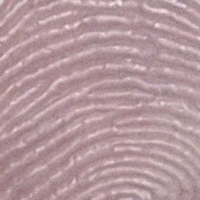
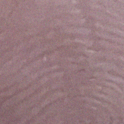
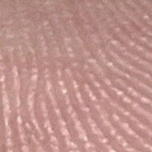
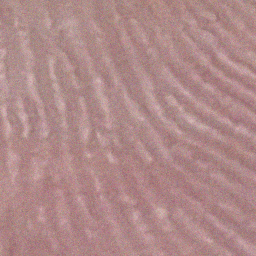

# Flash-Non-Flash-Fingerphoto-Database (FNF)

The **Flash–Non-Flash Fingerphoto (FNF) Database** is a two-session contactless fingerprint dataset consisting of paired **flash** and **non-flash** fingerphoto images. It was collected under **IRB approval** using a controlled smartphone-based acquisition setup and contains **processed, privacy-preserving images (no personal identifiers)** and is designed for algorithm development, evaluation, and analysis.

## Dataset Structure
```
FNFDatabase/
└── Session1/
    ├── Flash/
    └── Non-Flash/
└── Session2/
    ├── Flash/
    └── Non-Flash/
```
Each session contains paired flash and non-flash fingerphoto images captured under controlled conditions.

A few representative samples are shown below.

### Example Samples

**ID 1**  
| Flash | Non-Flash |
|------|-----------|
|  |  |

**ID 2**  
| Flash | Non-Flash |
|------|-----------|
|  |  |

## Access & License Agreement

Access to the FNF Database requires completion of a **License Agreement**.

### Steps to Request Access
1. Download and fill the [**FNF_License_Agreement.pdf**](FNF_License_Agreement.pdf) provided.
2. Ensure the License Agreement is **signed by an authorized institutional representative** (students must also obtain their advisor’s signature).
3. Email the signed license agreement to the contact address below.
4. Once filled, a **secure download link** valid for **48 hours** will be provided.

The dataset is licensed for **non-commercial academic use only** and may not be redistributed, modified for sharing, or used for identification, forensic, or surveillance purposes.

## Contact Information

For dataset access requests or inquiries: **fnfdatabase.query@gmail.com**

## Citation

If you use the FNF Database in any publication (paper, thesis, report, poster, or presentation), **citation is mandatory**:

```bibtex
@unpublished{Sahoo2025Fusion2Print,
  author = {Sahoo, Roja and Namboodiri, Anoop},
  title  = {Fusion2Print: Deep Flash--Non-Flash Fusion for Contactless Fingerprint Matching},
  note   = {Manuscript under review},
  year   = {2025},
  institution = {IIIT Hyderabad}
}
```
*(A full citation will be provided upon paper publication.)*

Please email a copy of any resulting publication to the dataset authors.

## References
Taylor, M., Hicklin, R. A., Kiebuzinski, G.  
**Best Practices in the Collection and Use of Biometric and Forensic Datasets**.  
NIST Interagency/Internal Report 8361, National Institute of Standards and Technology, 2021.  
DOI: 10.6028/NIST.IR.8361  
PDF: https://nvlpubs.nist.gov/nistpubs/ir/2021/NIST.IR.8361.pdf

## Source Code

The code can be found in /src.
